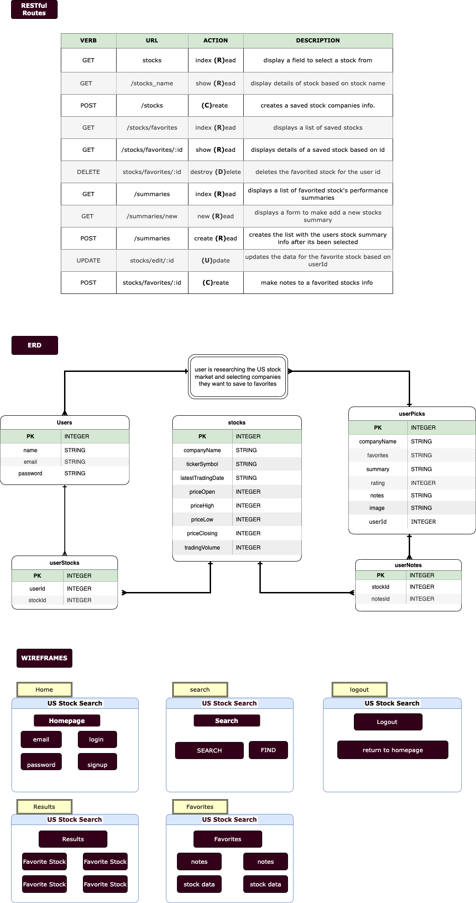

# MARKET-WATCH

## Project Description

This is a fullstack application that will allow a user to research publicly traded stocks on the US stock market. The user can save favorite stocks they want to track to their profile. Once saved comments can be added to individual stocks.

##Technical Dependencies
- [ ]axios
- [ ]css/bootstrap
- [ ]cookie-parser
- [ ]crypto-js
- [ ]dot.env
- [ ]express
- [ ]express-ejs-layouts
- [ ]fs
- [ ]postgres
- [ ]./models
- [ ]node.JS
- [ ]sequelize
- [ ]path

## How to Install 
    - Fork and clone this repository
    - Run `npm install`
    - Run `npm i sequelize pg`
    - Go to https://www.alphavantage.co/support/#api-key to sign up for a free API key
    - Create a `.env` file in the main directory
    - Enter the API key in the `.env` after: `Alphavantage_API_KEY=`
    - Enter `SECRET=` on second line of `.env` and type your secret password after `=`
    - Enter `PORT=` on third line of `.env` and select a desired port.
    - The PORT will match the last lines of code in the index.js file 
    ***** Like this example 
    ***** `const PORT = process.env.PORT || 3001
    *****app.listen(PORT, ()=>{
    *****console.log(`You are using PORT ${PORT}`)
    *****})`

## User Stories
- [ ] As a user I would like to enter a company name I want to research
- [ ] As a user I would like to see the ticker symbol that matches the company I am researching
- [ ] As a user I would like to see the stocks high and low price plus daily volume for a selected stock to include the current daily and previous daily close plus the change price as a percent from previous days close
- [ ] As a user I would like to tag a specific company or ticker so it saves it to my favorites
- [ ] As a user I would like to add comments to my selected companies saved in my favorites

## Stretch Goals
- [ ] As a user I would like to see colored prices such as green if the price is higher than the market open price or red if it is lower
- [ ] As a user I would like to see a company's description or recent news article
- [ ] As a user I would like to see a streaming banner with the ticker symbols from my selected stocks
- [ ] As a user I would like to see a graphical chart of the historical price data

## ERD - RESTful routing - Wireframes

## Resources
