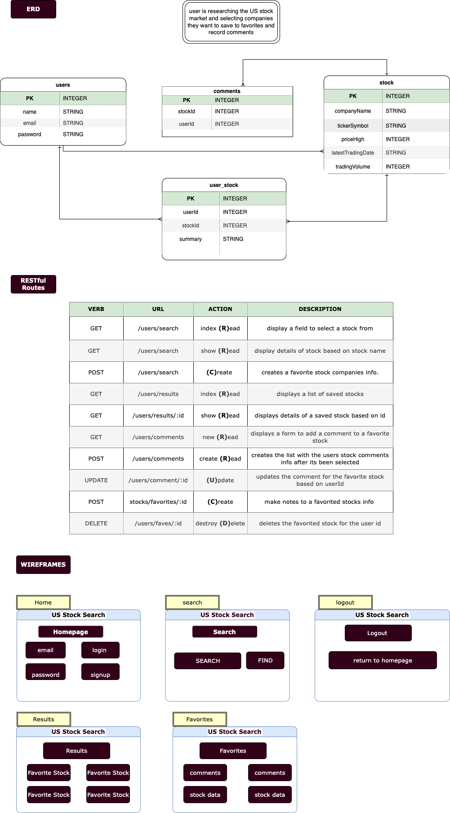

# PROJECT-2
$*****  US STOCK EXCHANGE RESEARCH AND FAVORITES  *****$

*** This is a fullstack application that will allow a user to research over 4,000 stocks from the US stock market and save favorites to their profile.
*** The API being used is through Alphavantage.co

*** USER STORIES *** 

- [ ] As a user I would like to enter a company name I want to research
- [ ] As a user I would like to see the ticker symbol that matches the company I am researching
- [ ] As a user I would like to see the stocks high and low price plus daily volume for a selected stock to include the current daily and previous daily close plus the change price as a percent from previous days close
- [ ] As a user I would like to tag a specific company or ticker so it saves it to my favorites
- [ ] As a user I would like to add notes to my selected companies saved in my favorites

*** STRETCH GOALS ***
- [ ] As a user I would like to see colored prices such as green if the price is higher than the market open price or red if it is lower
- [ ] As a user I would like to see a company's description or recent news article
- [ ] As a user I would like to see a streaming banner with the ticker symbols from my selected stocks
- [ ] As a user I would like to see a graphical chart of the historical price data

*** TECH STACK ***
- [ ]Postgres
- [ ]Express
- [ ]Node.JS
- [ ]CSS/Bootstrap

TO USE THIS PROGRAM RUN:
nmp install
npm i sequelize pg

